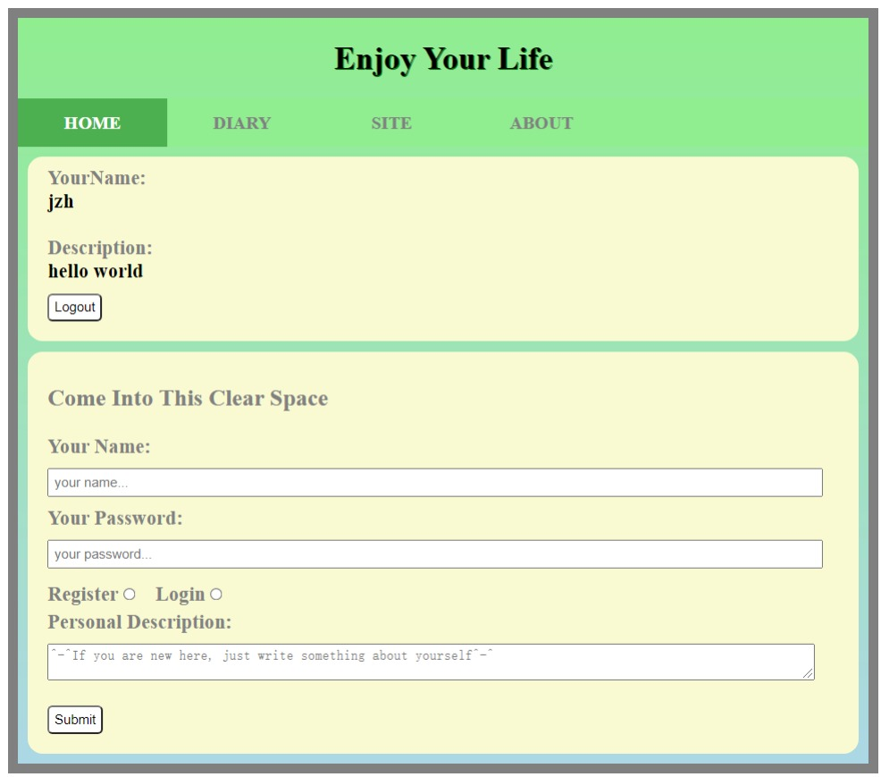
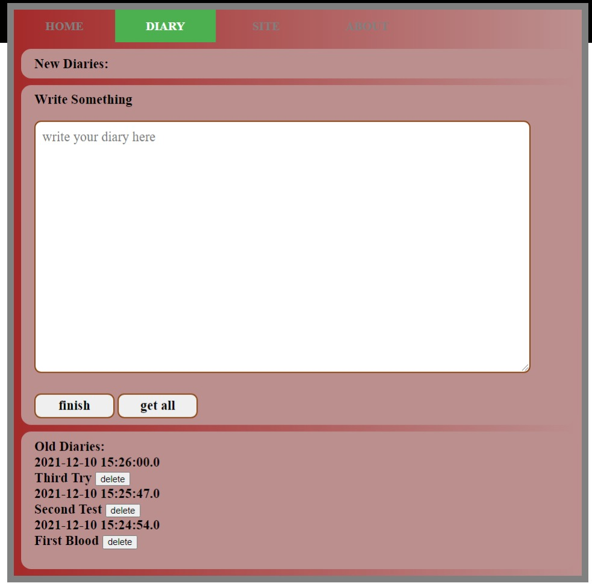

# Record-Life

## 简介：

### 一个入门级Java Web项目，采用servlet和Ajax实现前后端分离，有利于初学者初步理解掌握Web编程以及前后端分离的思想。

## 功能：

### 写日记，记录生活

## 使用的工具主要有：

### Java

### Mysql

### Html JavaScript Css

### Ajax

### Maven

## 演示

### 登录页面

### 日记页面

## 欢迎star学习
